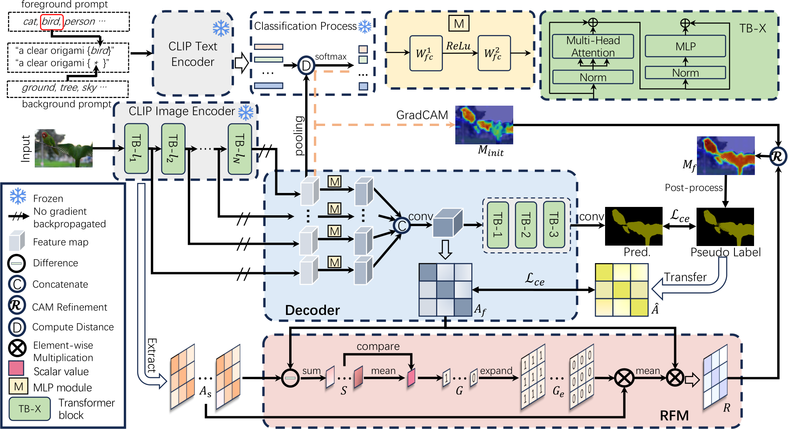

# Weakly Supervised Semantic Segmentation

English | [한국어](./README.ko.md)

Commissioned WSSS research to improve WeCLIP+: **53.31% mIoU on all 40,137 COCO-Val 2014 images, +1.5 percentage points over WeCLIP+ ViT-B/16 at 51.8%**.

[](LICENSE)
[](https://www.python.org/downloads/)



## Why

Weakly supervised semantic segmentation learns pixel-level predictions from image-level class labels. Because no ground-truth masks are available during training, errors in automatically generated pseudo-masks can accumulate around object boundaries and background regions. The project therefore focused on finding only the unreliable pixels, repairing them, and returning the corrected masks to training.

## How

The CLIP ViT-B/16 and DINOv2 encoders remain frozen. A fusion head and decoder learn from their complementary representations. Pixels where the two representations disagree are treated as unreliable, repaired through pseudo-label refinement, and reused in self-training. This concentrates learning on uncertain regions without fine-tuning the foundation encoders.

## Result

| Method | Evaluation set | mIoU |
|---|---:|---:|
| WeCLIP+ ViT-B/16 | COCO-Val 2014 | 51.8% |
| **Refined pseudo-label model** | **40,137 images** | **53.31%** |

The final full-set evaluation improved mIoU by **1.5 percentage points** over WeCLIP+.

## Technical flow

```text
Image + image-level labels
        |
        v
Frozen CLIP + DINOv2 encoders
        |
        v
Fusion head + segmentation decoder
        |
        v
Disagreement-based unreliable-pixel detection
        |
        v
Pseudo-mask repair -> self-training
```

The implementation builds on [WeCLIP+ (Zhang et al., TPAMI 2025)](https://github.com/zbf1991/WeCLIP), the journal extension of the CVPR 2024 WeCLIP work.

## Repository layout

```text
WeCLIP_Plus/                # WeCLIP+ models, decoders, and attention-affinity variants
clip/                       # CLIP library and CAM tooling
datasets/                   # COCO and VOC loaders
configs/                    # Training and evaluation configurations
scripts/                    # Distributed training paths and designed variants
utils/                      # Losses, optimization, evaluation, and image utilities
test_msc_flip_coco.py       # COCO multi-scale and flip evaluation
test_msc_flip_voc.py        # VOC multi-scale and flip evaluation
environment.yaml            # Conda environment
```

## Quick start

```bash
conda env create -f environment.yaml
conda activate weclip-plus

# Train the public WeCLIP+ integration on COCO
python scripts/dist_clip_coco.py --config configs/coco_attn_reg.yaml

# Evaluate a checkpoint
python test_msc_flip_coco.py --config configs/coco_attn_reg.yaml --weights <path>
```

## Public repository scope

This repository contains the baseline integration, model structure, configurations, evaluation paths, and designed-variant scripts. Contracted training data, trained checkpoints, and the final refinement implementation are not included in the public release.

## License

MIT.
